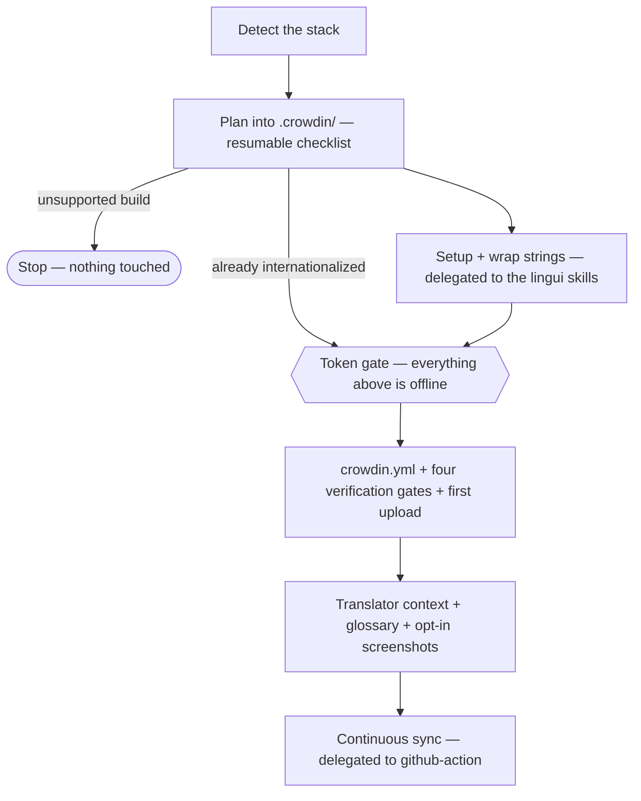

# Crowdin Skills

This repository contains Agent Skills for [Crowdin](https://crowdin.com), an AI-powered localization platform for teams and businesses.

## What are Agent Skills?

Skills are reusable capabilities for AI coding agents. They provide procedural knowledge and best practices that help AI agents implement features correctly and efficiently.

## Installation

Install all Crowdin skills with a single command:

```bash
npx skills add crowdin/skills
```

This gives your AI coding agent access to comprehensive Crowdin knowledge including best practices, common pitfalls, and configuration patterns.

### Claude Code Plugin

Alternatively, install the skills as a [Claude Code plugin](https://code.claude.com/docs/en/discover-plugins). In Claude Code, run:

```
/plugin marketplace add crowdin/skills
/plugin install crowdin@crowdin-skills
```

All skills load automatically. Every commit to `main` is a new plugin version, so newly added skills reach you as soon as the plugin updates. Turn on auto-update once (run `/plugin`, open the **Marketplaces** tab, select `crowdin-skills`, choose **Enable auto-update**), or update by hand:

```
/plugin update crowdin@crowdin-skills
/reload-plugins
```

A running session keeps the version it started with, so new skills appear after `/reload-plugins` or a restart. Note that `/plugin marketplace update` only refreshes the catalog and does not update the installed plugin.

The plugin also includes the [Crowdin MCP Server](https://support.crowdin.com/developer/crowdin-mcp-server/), giving your agent direct access to Crowdin projects. Authenticate via the browser OAuth flow on first use (`/mcp` in Claude Code). Crowdin Enterprise users should connect their organization endpoint (`https://{organization}.mcp.crowdin.com/v2/mcp`) manually instead.

### Other Agent Tools (Plugin Install)

The repo is also installable as a plugin via the [`plugins` CLI](https://npmx.dev/package/plugins), which auto-detects your installed agent tools (Claude Code, Cursor, Codex, Grok Build, Kimi Code, GitHub Copilot CLI, VS Code) and installs through each tool's native plugin system:

```bash
npx plugins add crowdin/skills
```

### Gemini CLI

The repo is a [Gemini CLI extension](https://geminicli.com/docs/extensions/) — install it with:

```bash
gemini extensions install https://github.com/crowdin/skills
```

### GitHub CLI

The [GitHub CLI](https://cli.github.com) (v2.90+) can install the skills for GitHub Copilot or any other supported agent:

```bash
gh skill install crowdin/skills --all
```

Use `--agent <name>` (e.g. `--agent cursor`) to target a specific tool, and `gh skill update` to pull newer versions.

## Available Skills

### create-app

Builds a Crowdin app end to end and leaves the user looking at it: scaffolds with `@crowdin/serverless-apps-cli`, writes the UI with `@crowdin/serverless-apps-sdk`, publishes into the organization and opens it. Written for translators and localization managers rather than developers, so it derives what it can (edition, placement, scopes, editor modes) and asks only questions a non-programmer can answer. Covers the placements that have no preview link, the requests that need a backend and what to offer instead, and the checks that catch a published app which does not actually render.

### crowdin-cli

Guides correct usage of Crowdin CLI v5 — the `crowdin` command that syncs localization files between a local project and Crowdin. Covers installation and authentication, `crowdin.yml` configuration (placeholders, file groups, language mapping), the core upload/download workflow, `auto-translate`, machine-readable output for scripts and agents (`-o json|toon|plain`), exit codes, CI/CD patterns, and migration from CLI v4.

### github-action

Sets up, reviews, and debugs [crowdin/github-action](https://github.com/crowdin/github-action) — the workflow step that syncs sources and translations and opens the translation PR. Covers the fixed pipeline a single step runs (and the defaults that surprise people), the git half it performs after a download, secrets, token scopes and the permissions PR creation needs, the `command` escape hatch and what it silently skips, and a symptom → cause table for runs that produce no PR or no CI checks. Ships a full inputs/outputs reference and recipes for the patterns upstream doesn't document — split upload/download workflows, GitHub App auth, post-processing before the PR — linking to the action's own examples for the rest.

### context-extraction

Fills `ai_context` in Crowdin JSONL files so translators get clear context. Covers which strings need context (ambiguous short words, plurals, inline tags, etc.), how to write 1–3 sentence descriptions (UI element type, placement), and safe editing rules (only edit `ai_context`, validity checklist).

### crowdin-context-cli

Documents the `crowdin context` commands (`download`, `upload`, `status`, `reset`) for AI enrichment. Covers CLI options (filters, output path, overwrite/dryrun), coverage statistics, JSONL format, and the workflow: download → fill `ai_context` (e.g. with context-extraction) → upload.

### glossary-generation

Generates a starting glossary for a Crowdin project from the project's own source strings and uploads it with the CLI. Covers which terms earn an entry (product and feature names, domain vocabulary, words that are ambiguous out of context, UI objects that must stay distinct), descriptions translators can act on, the review gate before anything reaches the project, and the idempotent upload — `glossary list` first, merge into an existing glossary with `--id`, never a duplicate. Source-language terms only; translations are never invented. Works standalone on any connected project, and `i18n-setup` delegates its glossary steps here.

### generate-screenshots

Captures screenshots of the running app with a browser the agent drives and uploads them to Crowdin as visual context, auto-tagged to the strings they show. Screen-driven rather than string-driven: a committed screen map (`.agents/crowdin-screens.md`) records which screens exist and how to reach them, uploads key on the filename so re-runs update images in place instead of duplicating, and a CroQL coverage query (`count of screenshots = 0`) measures what is still missing. The user starts the app and logs in; the agent does the rest — and when no browser can be driven, a publish-only mode uploads screenshots the user captures themselves. Works standalone on any connected project.

### crowdin-api-client

Guides practical usage of `@crowdin/crowdin-api-client` for production workflows. Covers client/module selection, pagination with `.withFetchAll()`, uploads via storage + file creation, translation build/download flow, runtime options (`fetch`, retries, timeout), and error handling patterns (`CrowdinValidationError` vs `CrowdinError`).

### croql

Helps build, validate, and optimize Crowdin CroQL expressions for strings, translations, TM segments, and glossary terms. Includes operator guidance, context-specific fields, editor-filter equivalents, and API endpoint templates with URL-encoding reminders.

### graphql

Helps write and debug valid Crowdin GraphQL queries with schema-aware arguments, pagination, filtering/sorting, and node/rate-limit safety checks. Includes a troubleshooting pattern for common Playground errors like unsupported field arguments.

### i18n-setup

Takes a project from hardcoded strings to continuously translating through Crowdin — or connects an already-internationalized project. Detects the stack, delegates library implementation to the ecosystem's own skills (v1: JavaScript/TypeScript + Lingui via the `lingui` plugin, whichever framework the project uses), wraps existing strings with a self-healing recall check, writes a verified `crowdin.yml`, enriches string context for translators, drafts a reviewed starting glossary, captures and uploads screenshots when the user opts in, and hands continuous sync to the `github-action` skill. Plans into a resumable `.crowdin/` workspace; runs on any agent, uses parallel subagents when available.



The Lingui stack requires the `lingui` plugin — the setup, wrapping, and recall passes are delegated to it rather than duplicated here. A run installs it when missing and stops to ask only when that install can't run — never improvising library guidance in its place. The glossary, screenshot, and CI phases delegate the same way to the `glossary-generation`, `generate-screenshots`, and `github-action` skills in this repository — installing the whole set, or the plugin, already covers them.

## Quick Start

1. **Install all Crowdin skills:**
   ```bash
   npx skills add crowdin/skills
   ```

2. **Use with your AI coding agent:**
   The skills will automatically be available when working on projects that use Crowdin, or when you mention terms that fall under the scope of the skills.

3. **Manual trigger:**
   You can explicitly reference the skills in your prompts:
   ```
   "Using the Crowdin skills, help me enrich the context of strings before translation starts"
   ```

### Installing Individual Skills

If you prefer, you can install specific skills:
```bash
npx skills add crowdin/skills --skill create-app
npx skills add crowdin/skills --skill crowdin-cli
npx skills add crowdin/skills --skill github-action
npx skills add crowdin/skills --skill context-extraction
npx skills add crowdin/skills --skill crowdin-context-cli
npx skills add crowdin/skills --skill glossary-generation
npx skills add crowdin/skills --skill generate-screenshots
npx skills add crowdin/skills --skill crowdin-api-client
npx skills add crowdin/skills --skill croql
npx skills add crowdin/skills --skill graphql
npx skills add crowdin/skills --skill i18n-setup
```

## Compatibility

These skills are compatible with:
- [Claude Code](https://claude.ai/product/claude-code)
- [Cursor](https://cursor.sh)
- [OpenAI Codex](https://openai.com/codex/)
- [Gemini CLI](https://geminicli.com)
- [GitHub Copilot](https://github.com/features/copilot)
- [OpenCode](https://opencode.ai)
- [Cline](https://cline.bot/)
- [Windsurf](https://codeium.com/windsurf)
- And other agents supporting the [Agent Skills](https://agentskills.io) format

## Resources

- [Crowdin Documentation](https://support.crowdin.com)
- [Crowdin GitHub](https://github.com/crowdin)
- [Skills.sh](https://skills.sh)
